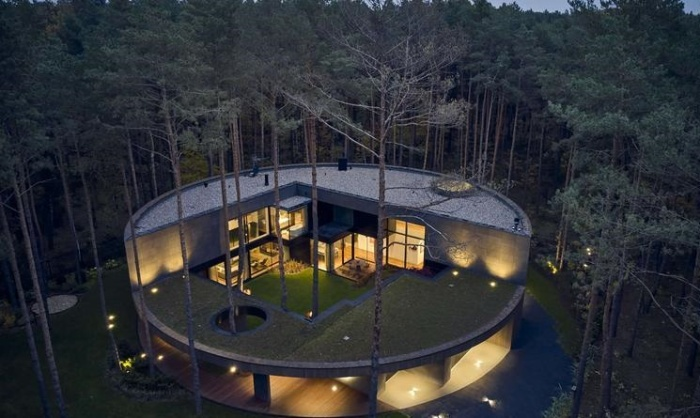
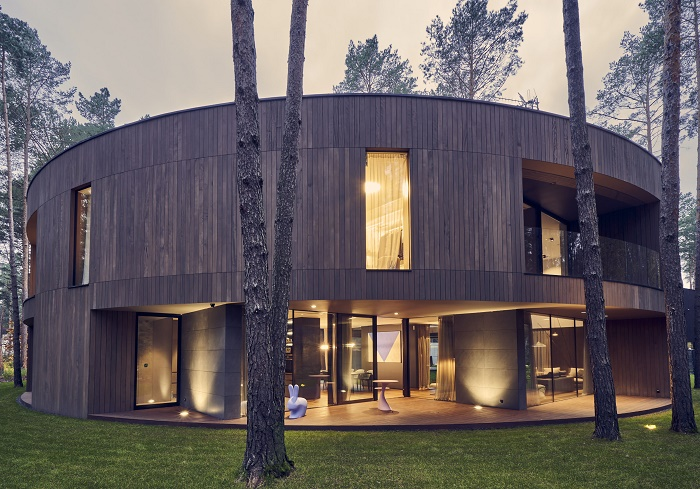
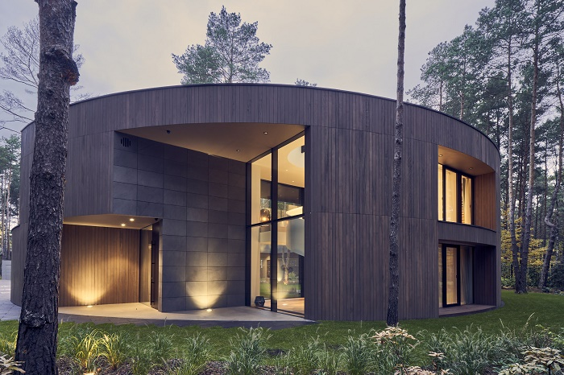
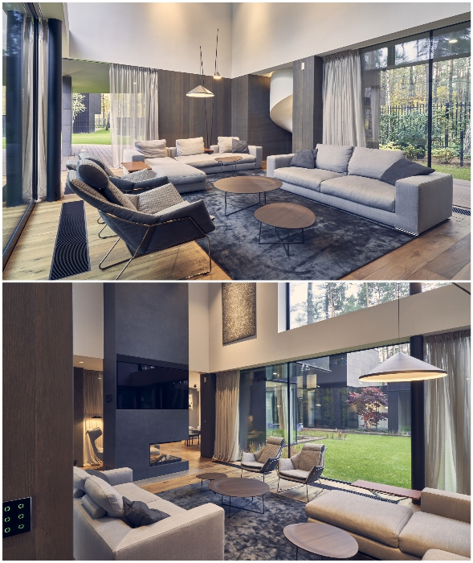

# Circle Wood house successfully integrated into the landscape

Among the dense pine forests in Poland, the construction of an unusual circular house called Circle Wood was completed. The architect managed to fit it harmoniously into the wild landscape, so that the owner of a country residence could feel himself detached from the mundane world, and he did not abandon the feeling of a permanent walk through the woods. Homeowners will also be pleased with the courtyard, sculpted staircase, skylights and many interesting details that are unlikely to be found in a traditional dwelling.

## In the midst of the virgin Polish forest, in Izabelin, an amazing round house appeared. 

It was designed by Polish architect Przemysław Olczyk and his studio Przemek Olczyk mobius architectitekci. The owner of the studio drew inspiration from nature, in particular, an ordinary stump gave rise to the idea of creating a cylindrical house, which would be in perfect harmony with the surrounding landscape.

The main priority during construction was to maximize the preservation of trees in the natural area. This was the reason why a courtyard was created inside the house, where century-old pines and graceful birch trees were left to grow.

Despite the fact that the house from the facade looks quite impressive and has a lot of territory - 400 square meters, the living space is organized on a smaller part of it. The residential space itself has a smaller part of it. Not only the whole building doesn't have two stories, but a significant part of the space is taken up by the creation of the yard, which is a continuation of the forest.

As conceived by the author of the project, a large part of the building is practically open, with the courtyard smoothly beyond the residence, merging with the natural landscape. Despite this openness, the privacy of the owner, who is a collector, was also taken care of. His lot is surrounded by a fence, so idle gawkers can't enter the territory of the house.

Overall, the space is more like a private art gallery in the middle of the virgin forest of Campinos National Park. The house, however, is a living space with a living room, dining room, kitchen, outdoor spa area and a two-car garage on the first floor.

